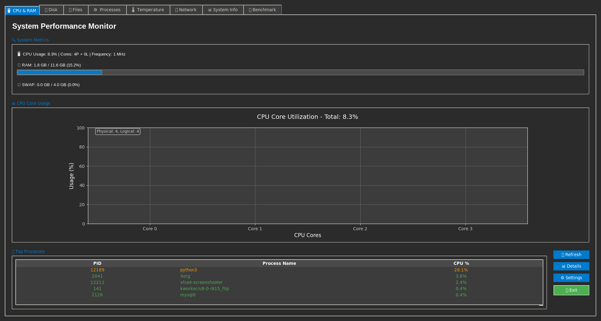

# Modern System Monitor

An advanced system monitor with a modern user interface, written in Python using Tkinter.

## 🚀 Features

### 📊 System Monitoring
- **CPU & RAM**: Real-time processor and memory usage
- **💾 Disk**: Partition monitoring and disk space usage
- **🌡️ Temperature**: CPU and component temperature sensors
- **🌐 Network**: Transfer speeds and interface statistics
- **⚙️ Processes**: Process management with sorting and search

### 📁 File Explorer
- File system browsing with context menu
- Copy/cut/paste operations
- File renaming and deletion
- Sorting by various criteria

### 🛠️ Advanced Features
- **📊 System Information**: Detailed hardware and system data
- **🚀 Benchmark**: Computational performance test (prime numbers)
- **🌡️ Temperature Monitor**: lm-sensors support
- **🔌 Network Monitor**: Speed charts and connection statistics

## 📋 System Requirements

- Python 3.7+
- Linux system (recommended) or Windows
- lm-sensors package (for temperature monitoring)

## 🔧 Installation

1. Clone the repository:
```bash
git clone <repository-url>
cd system-monitor
```

2. Install dependencies:
```bash
pip install -r requirements.txt
```

3. (Optional) Install lm-sensors for temperature monitoring:
```bash
sudo apt-get install lm-sensors
sudo sensors-detect
```

## 🎯 Running

```bash
python SystemMonitor.py
```

## 📦 Dependencies

Main Python libraries:
- `psutil` - system monitoring
- `matplotlib` - charts and visualizations
- `tkinter` - user interface

## 🖥️ Interface

The application uses a modern, dark theme with tabs:
- **CPU & RAM**: Core utilization and memory charts
- **Disk**: Partitions and space usage charts
- **Files**: File explorer with operations
- **Processes**: System process management
- **Temperature**: Temperature sensors
- **Network**: Network statistics
- **System Info**: Detailed system information
- **Benchmark**: Performance tests

## 🔨 Benchmark Program Compilation

The application includes a prime number benchmark that requires a compiled C++ program:

```bash
g++ -O3 -o prime_numbers prime_numbers.cpp
```

The `prime_numbers` program should be located in the application's root directory.

## 📷 Screenshot



## 🐛 Troubleshooting

### Temperature Sensors Issues
```bash
sudo sensors-detect --auto
sudo service kmod start
```
### For AppImage Version:
If the AppImage doesn't run, you may need to install FUSE on your Linux system:
```bash
https://github.com/AppImage/AppImageKit/wiki/FUSE
```

### Permission Issues
Ensure the application has appropriate permissions to read system information.

### Benchmark Program Issues
Check if the `prime_numbers` program is compiled and available in the path.

### Compilation with nuitka
```bash
pip install nuitka
python3 -m nuitka --standalone --onefile --follow-imports --include-package=psutil --include-package=matplotlib --enable-plugin=tk-inter --windows-disable-console --include-data-files=prime_numbers=prime_numbers --output-filename=SystemMonitor SystemMonitor.py 
```

## 📄 License

MIT License

## 🤝 Contributing

Pull requests are welcome! For major changes, please open an issue first to discuss.
```

**requirements.txt**
```txt
psutil>=5.9.0
matplotlib>=3.5.0
```

**Notes:**
1. The `requirements.txt` contains the main dependencies required for the application
2. Most modules (tkinter, pathlib, datetime, etc.) are part of Python's standard library
3. The main external dependencies are `psutil` and `matplotlib`
4. For full temperature functionality, the system package `lm-sensors` is required
5. The benchmark requires a compiled C++ program `prime_numbers`

The application offers comprehensive system monitoring with a modern user interface and advanced diagnostic features.
